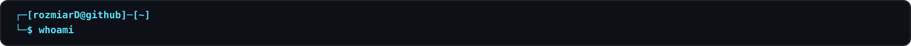
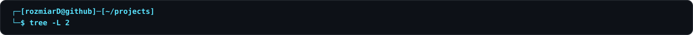
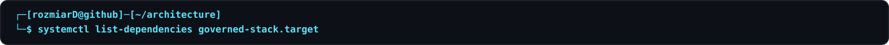
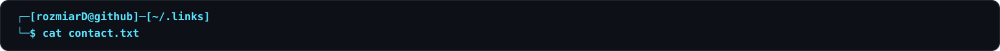
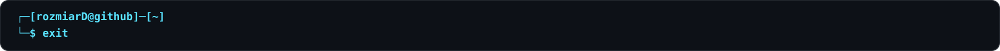

  

  

<pre>
Messing with computers since 1994.
Fixing some, breaking others, automating the rest.

These days: Linux, networks, infrastructure,
security, systems architecture and GenAI.

Still changing things that probably worked fine before I touched them.
</pre>

  

<pre>
.
├── governed-systems
│   ├── <a href="https://github.com/rozmiarD/SCLite">SCLite</a>
│   │   └── contracts · evidence · verification
│   ├── <a href="https://github.com/rozmiarD/GovEngine">GovEngine</a>
│   │   └── policy · approval · governance
│   ├── <a href="https://github.com/rozmiarD/RExecOP">RExecOP</a>
│   │   └── execution · lifecycle · runtime
│   ├── <a href="https://github.com/rozmiarD/tecrax">Tecrax</a>
│   │   └── security ops · domain semantics
│   ├── <a href="https://github.com/rozmiarD/ravenclaw">Ravenclaw</a>
│   │   └── governed security runtime
│   └── <a href="https://github.com/rozmiarD/signposter">Signposter</a>
│       └── supervised agentic development
│
├── llm-lab
│   └── <a href="https://github.com/rozmiarD/llm-fine-tuning-datasets">llm-fine-tuning-datasets</a>
│       └── datasets · evaluation · governance
│
└── side-quests
    └── <a href="https://github.com/rozmiarD/HOBT">HOBT</a>
        └── tactics · cards · tiny plastic people
</pre>

  

<pre>
governed-stack.target
● ├─tecrax.profile
● │ ├─rexecop.runtime
● │ ├─govengine.service
● │ └─sclite.verify
● │
● ├─rexecop.runtime
● │ ├─govengine.service
● │ └─sclite.verify
● │
● ├─govengine.service
● │ └─sclite.verify
● │
● └─sclite.verify

tecrax.profile      domain semantics / intents / workflows
rexecop.runtime     execution / lifecycle / I/O
govengine.service   policy / approval / governance
sclite.verify       contracts / evidence / verification
</pre>

  

<pre>
PROJECT      STATE      FOCUS
SCLite       stable     contracts / verification
GovEngine    running    governance / policy
RExecOP      running    execution / runtime
Tecrax       running    infra / security ops
</pre>

  

<pre>
github    <a href="https://github.com/rozmiarD">github.com/rozmiarD</a>
linkedin  <a href="https://www.linkedin.com/in/krzysztofprobola/">linkedin.com/in/krzysztofprobola</a>
email     <a href="mailto:probola.k@gmail.com">probola.k@gmail.com</a>
</pre>

  

<pre>
logout
Connection to github closed.
</pre>
